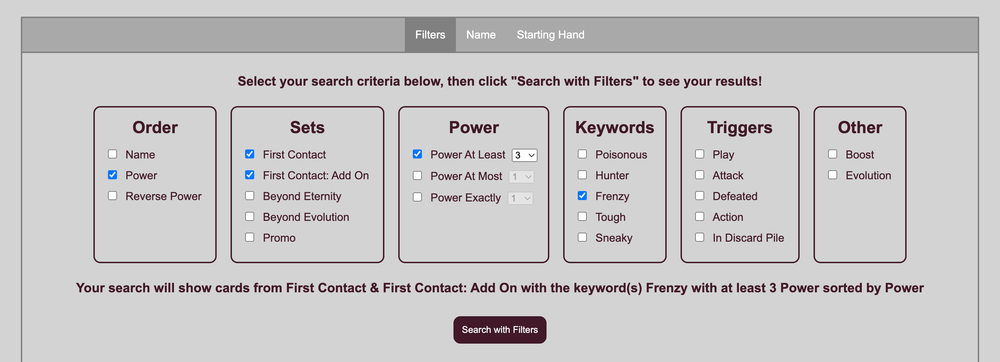
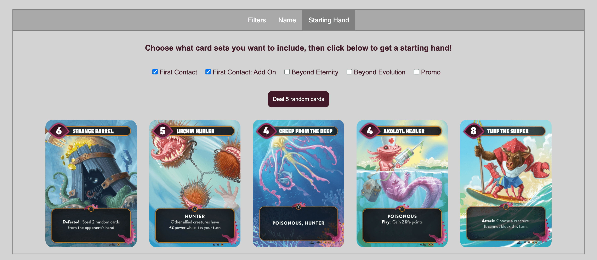

# Mindbug

## What is Mindbug?

Taken from the [game's website](https://mindbug.me/):

> Mindbug combines the accessibility and fairness of a simple card game with the strategic depth of a complex Strategy Card Game. The result is a skill-based dueling card game that feels utterly different from all the other card games you have played before.

> Even though Mindbug is extremely easy to get into, the game will keep surprising you with new and exciting challenges and combos. The unique Mindbug mechanic allows you to control your opponents‘ creatures and leads to unique decision-making that requires even veteran card game players to adjust their traditional playstyle.

## What is my affiliation with Mindbug?

I have none! I am just a fan who loves the game and wanted to make a webpage that allowed people to easily search for Mindbug cards.

The game was designed by Skaff Elias, Richard Garfield, Marvin Hegen, and Christian Kudahl.

## Introduction

This webpage features three different ways to interact with the board game Mindbug. Users can filter cards by various parameters, search for a card by name, and receive a starting hand of cards.

## Navigation

The user can navigate between the features by clicking on any of the three tabs.


## Features

### Filtering

A user can filter Mindbug cards by card sets, power, keywords, triggers, boost, and evolution. On this tab the user can also sort by name, power, or reverse power. The user can apply as many filters at once as they want, and the more filters are set, the _less_ results will be shown. Once the user clicks the "Search with Filters" button, the cards meeting the criteria will be shown.

A statement above the search button will update and show the user's currently selected filters.



### Searching by Name

A user can begin typing a card's name in the search box. Any cards that begin with the typed letter(s) will appear and can be clicked. Once a name is submitted, that card will appear below.


### Starting Hand

A user can choose from any card set(s) and then receive a random starting hand of five cards. If a card is a double (i.e., appears twice in the deck), it has the chance to appear twice in the starting hand. Evolution cards levels 2 and 3 are excluded from appearing in the starting hand.


## Contributing

### Local Development

```bash
npm install

npm run dev
```

This will open a [browsers-sync][browser-sync-website] instance.

[browser-sync-website]: https://browsersync.io/
